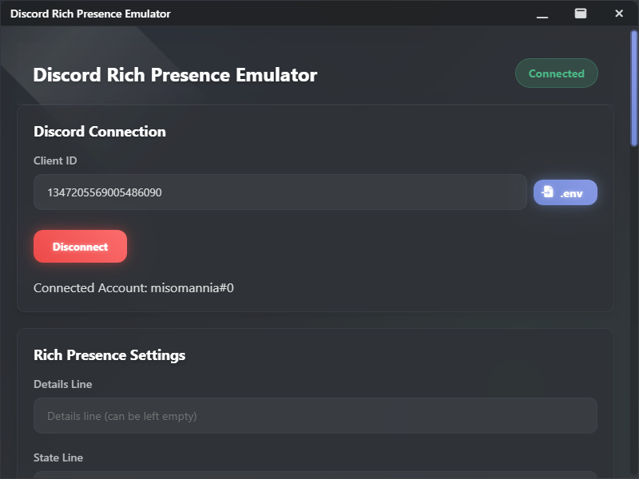
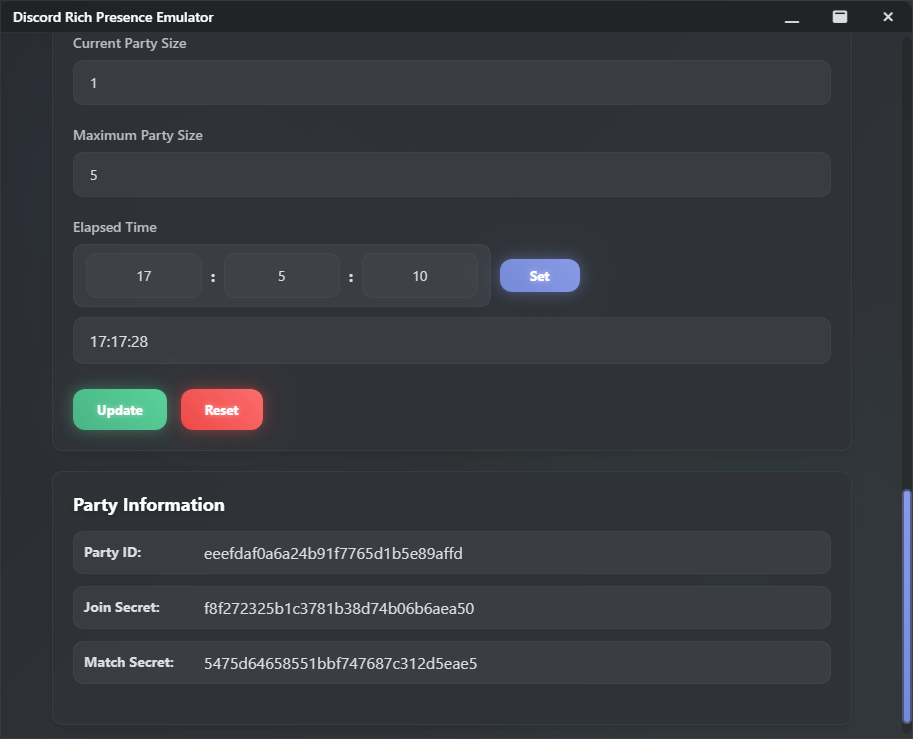
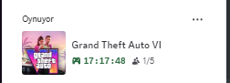
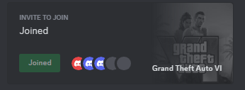

# Discord Rich Presence Emulator

[](https://opensource.org/licenses/MIT)
[](https://discord.com/developers/docs/rich-presence/how-to)
[](https://www.electronjs.org/)
[](https://www.typescriptlang.org/)
[](https://nodejs.org/)
[](https://github.com/i358/dRPC/stargazers)
[](http://makeapullrequest.com)
[](https://github.com/i358/dRPC/graphs/commit-activity)

A powerful and user-friendly Discord Rich Presence customization tool built with Electron.

> [!IMPORTANT]
> ## Prerequisites
> - Node.js (v14 or higher) [](https://nodejs.org/)
> - Discord Desktop Application [](https://discord.com/)
> - A Discord Application (for Client ID) [](https://discord.com/developers/applications)

## Features
- 🔌 Easy connection management with Discord []()
- 🎮 Real-time Rich Presence updates []()
- 🖼️ Custom image support (large and small) []()
- 🔗 Interactive buttons with custom URLs []()
- ⏱️ Elapsed time display and customization []()
- 👥 Party size and party information []()
- 🔐 Secure Client ID storage using .env []()
- 💾 Settings persistence across sessions []()

## 📸 Screenshots

<p align="center"><em>Main Interface - Rich Presence Configuration and Preview</em></p>
<div align="center">
  
</div>

<p></p>

<div align="center">
  
</div>

<p></p>

<div align="center">
  
</div>

<p></p>

<div align="center">
  
</div>

> [!NOTE]
> ## Setup Instructions
> 
> ### 1. Creating a Discord Application
> 1. Go to [Discord Developer Portal](https://discord.com/developers/applications)
> 2. Click "New Application" and give it a name
> 3. Navigate to the "Rich Presence" section
> 4. Upload your assets (images) if you plan to use them
> 5. Copy your Client ID from the "General Information" section
> 
> ### 2. Environment Configuration
> 1. Create a `.env` file in the project root
> 2. Add your Client ID:
> ```env
> CLIENT_ID=your_client_id_here
> ```
> 
> ### 3. Installation
> ```bash
> # Install dependencies
> npm install
> 
> # Build the application
> npm run build
> 
> # Start the application
> npm start
> ```

> [!NOTE]
> ## Usage Guide
> 
> ### Basic Setup
> 1. Launch the application
> 2. Enter your Client ID or click the ".env" button to load it automatically
> 3. Click "Connect" to establish Discord connection
> 
> ### Rich Presence Configuration
> 
> #### Text Display
> - **Details Line**: Main activity description
> - **State Line**: Secondary status information
> 
> #### Images
> - **Large Image**: Primary image display
>   - Key: Asset name from Discord Developer Portal
>   - Text: Hover text for the image
> - **Small Image**: Secondary image display
>   - Key: Asset name from Discord Developer Portal
>   - Text: Hover text for the image
> 
> #### Buttons
> - Configure up to 2 buttons
> - Each button requires:
>   - Label: Button text
>   - URL: Valid HTTPS URL
> 
> #### Time Tracking
> - Set custom elapsed time
> - Input hours, minutes, and seconds
> - Click "Set" to update
> 
> #### Party Information
> - Set current and maximum party size
> - View automatically generated:
>   - Party ID
>   - Join Secret
>   - Match Secret

> [!WARNING]
> ## Important Notes
> - Discord application must be running
> - Client ID must be valid
> - Image keys must match assets uploaded to Discord Developer Portal
> - URLs must start with HTTPS
> - Button labels must not be empty if URL is provided
> - Details or State must be at least 2 characters long

> [!NOTE]
> ## Troubleshooting
> 1. If connection fails:
>    - Verify Discord is running
>    - Check Client ID validity
>    - Restart the application
> 
> 2. If images don't appear:
>    - Verify asset names in Developer Portal
>    - Wait a few minutes for Discord to process new assets
>    - Ensure correct case sensitivity in image keys
> 
> 3. If buttons don't work:
>    - Verify URLs start with HTTPS
>    - Ensure both label and URL are provided
>    - Check URL validity

> [!CAUTION]
> ## Security
> - Never share your Client ID publicly
> - Use .env file for Client ID storage
> - Keep your Discord application credentials secure

## Contributing
Contributions are welcome! Please feel free to submit pull requests to the [GitHub repository](https://github.com/i358/dRPC).

## License
This project is licensed under the MIT License - see the [LICENSE](https://github.com/i358/dRPC/blob/main/LICENSE) file for details. 

---
Made with ❤️ by [i358](https://github.com/i358) 